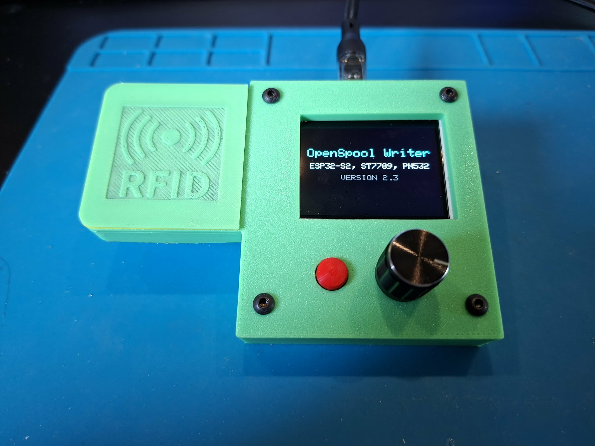

# ESP32-OpenSpool-NFC-Writer
Standalone OpenSpool NFC writer using ESP32 + PN532
# This is my first attempt at this, so i know Theres plenty room for improvement and please forgive any stupidity (where applicable 😄).

Standalone OpenSpool NFC writer/reader with UI.

## 📸 Device

---

## ✨ Features

- Standalone (no PC required)
- Smooth rotary encoder navigation
- ST7789 UI (low flicker partial redraw)
- NFC read / write / verify
- Clone mode
- Generic filament library
- Custom profiles (flash storage)
- Robust write system (retry + verify)

---

## 🧠 OpenSpool compatibility

OpenSpool is NOT standardized.

This project uses a **minimal JSON format** that is proven to work.

See: [docs/openspool-format.md](docs/openspool-format.md)

---

## 🧰 Hardware

### MCU
ESP32-S2

### Display
ST7789 240x320 (SPI)

### NFC
PN532 (I2C mode ONLY)

---

## 🔌 Wiring

### TFT
| Signal | GPIO |
|--------|------|
| SCLK   | 10   |
| MOSI   | 11   |
| CS     | 12   |
| DC     | 16   |
| RST    | 17   |
| BLK    | 9    |

### PN532
| Signal | GPIO |
|--------|------|
| SDA    | 33   |
| SCL    | 34   |

⚠️ Must be set to I2C mode

---

### Controls

| Function | GPIO |
|----------|------|
| Encoder A | 2 |
| Encoder B | 3 |
| Select    | 7 |
| Back/Home | 5 |

---

## 🎮 Controls

- Rotate = navigate
- KEY0 = select
- KEY1 = back

---

## 🏷️ Supported tags

- NTAG215 ✅
- NTAG216 ✅

Not supported:
- 4-byte UID tags
- Mifare Classic
- Locked OEM tags

---

## ⚠️ NFC stability

If tag is too close → errors occur.

**Recommended distance: 5–15mm**

---

## 🚀 Getting started

1. Open `src/U1_OpenSpool_Writer.ino`
2. Select ESP32-S2 board
3. Upload
4. Use encoder to navigate

---

## 📦 Libraries

- Adafruit_GFX
- Adafruit_ST7789
- Adafruit_PN532
- Preferences (built-in)

---

## 🔮 Future improvements

- OTA update
- Web UI
- Tag signal strength detection
- Text input editor

---

## 📜 License

MIT

---

## 👤 Author

Søren Hyldeqvist

---

## ⭐ Credits

Developed through real-world testing and reverse engineering.
